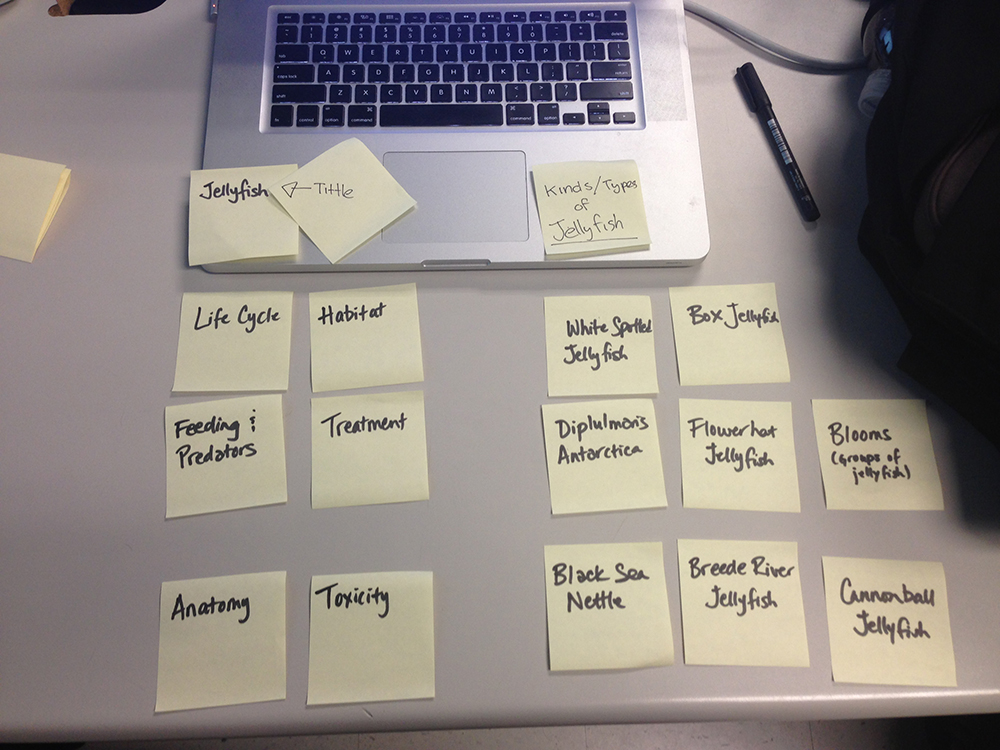
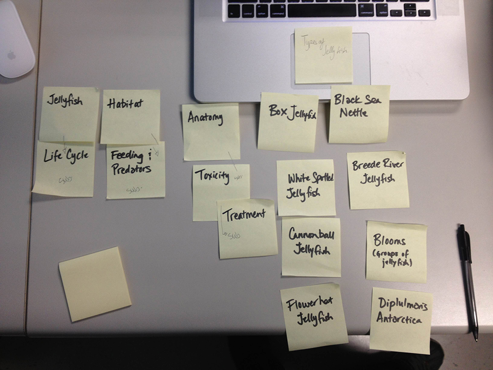

# Card sort report

The purpose of this card sort was to determine common navigation patterns and categories from the content of Jillian's jellyfish large data-oriented website.

## Specifics

The card sort was conducted by Jillian on September 10, 2013, between the times of 9:30 and 10:00 with the following participants:

- Jesus Monsalve
- Earaj Inam

### Cards

15 cards were used covering a broad range of applicable content for the website. The following topics were used as cards:

1. Jellyfish
2. Anatomy
3. Habitat
4. Toxicity
5. Treatment
6. Feeding and Predators
7. Blooms
8. Life Cycle
9. Culinary
10. White Spotted Jellyfish
11. Black Sea Nettle
12. Diplulmaris Antartica
13. Flowerhat Jellyfish
14. Cannonball Jellyfish
15. Box Jellyfish

## Card sort results

*Card sort 1 by Jesus Monsalve*

*Card sort 2 by Earaj Inam*

## Observations

- No questions that stood out unless there was unfamiliar terminology
- Did they struggle with certain articles or topics?
 - Common groupings: used Jellyfish as a category, and also grouped kinds/types of jellyfish
- Overall, groupings matched my expectations
- Personal thoughts while watching them organize: I will have to go back and reconsider my categories